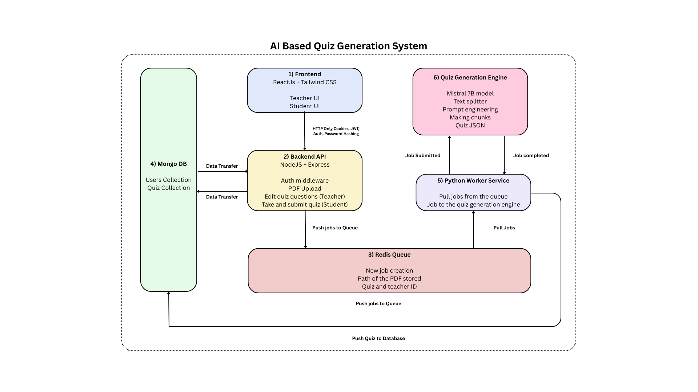

# NeoQuiz - AI Based Quiz Generation System

NeoQuiz is an intelligent quiz generation system that leverages AI to transform PDF documents into interactive quizzes. The system allows teachers to upload educational materials and automatically creates engaging assessments for students.

## System Architecture

The system consists of six main components:

1. **Frontend**: ReactJS + Tailwind CSS interface for teachers and students
2. **Backend API**: NodeJS + Express server handling requests and authentication
3. **Redis Queue**: Message broker for handling PDF processing jobs
4. **MongoDB Database**: Storage for users, quizzes, and other application data
5. **Python Worker Service**: Processes PDFs and generates quiz questions
6. **Quiz Generation Engine**: Uses Mistral 7B model to create quiz questions

!

## Directory Structure

```
├── backend/               # NodeJS + Express backend
│   ├── configs/           # Configuration files
│   ├── controllers/       # Route controllers
│   ├── db/                # Database connection and models
│   ├── middleware/        # Express middleware
│   ├── models/            # Mongoose models
│   ├── node_modules/      # Node dependencies
│   ├── routes/            # API routes
│   ├── utils/             # Utility functions
<!-- │   ├── .dockerignore      # Docker ignore file -->
│   ├── .env               # Environment variables
│   ├── app.js             # Express app setup
<!-- │   ├── Dockerfile         # Docker configuration -->
│   ├── index.js           # Entry point
│   ├── package-lock.json  # Package lock file
│   └── package.json       # Node dependencies list
│
├── frontend/              # ReactJS + Vite frontend
│   ├── node_modules/      # Node dependencies
│   ├── public/            # Static files
│   ├── src/               # React source code
│   ├── .env               # Environment variables
│   ├── index.html         # HTML entry
│   ├── package-lock.json  # Package lock file
│   ├── package.json       # Node dependencies list
│   ├── postcss.config.js  # PostCSS configuration
│   ├── tailwind.config.js # Tailwind CSS configuration
│   └── vite.config.js     # Vite configuration
│
└── model_dev/             # AI model and Python worker
    ├── file_loader/       # PDF processing utilities
    ├── model_logic/       # ML model integration
    ├── prompt_templates/  # Prompts for the AI model
    ├── .env               # Environment variables
    ├── app.py             # Python worker entry point
    ├── requirements.txt   # Python dependencies
    ├── .gitignore         # Git ignore file
    └── README.md          # Model documentation
```

## Technology Stack

- **Frontend**: ReactJS, Tailwind CSS, Vite
- **Backend**: Node.js, Express.js
- **Database**: MongoDB
- **Authentication**: JWT, HTTP-Only Cookies
- **Queue System**: Redis
- **AI Model**: Mistral 7B
- **Containerization**: Docker

## Setup Instructions

### Prerequisites

- Docker and Docker Compose (recommended)
- Node.js 18+
- Python 3.10+
- MongoDB
- Redis

### Installation

1. **Clone the repository**

```bash
git clone https://github.com/yourusername/neoquiz.git
cd neoquiz
```

2. **Set up the Python environment**

```bash
cd model_dev
pip install -r requirements.txt
```

3. **Install backend dependencies**

```bash
cd ../backend
npm install
```

4. **Install frontend dependencies**

```bash
cd ../frontend
npm install
```

5. **Set up environment variables**

Create and configure `.env` files in each directory (backend, frontend, model_dev) following the provided examples.

### Running the Application

1. **Start the Python worker service**

```bash
cd model_dev
python app.py
```

2. **Start the backend server**

```bash
cd backend
npm run dev
```

3. **Start the frontend development server**

```bash
cd frontend
npm run dev
```

The application should now be running at:
- Frontend: http://localhost:5173
- Backend API: http://localhost:5000

## Running with Docker (Optional)

```bash
docker-compose up
```

## How It Works

1. Teachers upload PDF educational materials through the web interface
2. The backend processes the upload and adds a job to the Redis queue
3. The Python worker service pulls jobs from the queue
4. The AI model processes the PDF content and generates quiz questions
5. Generated quizzes are stored in MongoDB and made available to students
6. Students can log in and take the quizzes assigned to them

## Contributing

Contributions are welcome! Please feel free to submit a Pull Request.

## License

This project is licensed under the MIT License - see the LICENSE file for details.